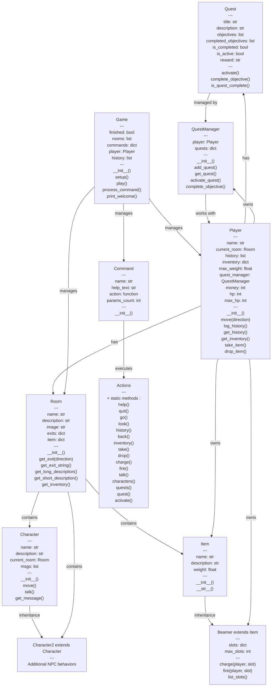

# TBA

Ce repo contient la première version (minimale) du jeu d’aventure TBA.

Les lieux sont au nombre de 6. Il n'y a pas encore d’objets ni de personnages autres que le joueur et très peu d’interactions. Cette première version sert de base à ce qui va suivre, et sera améliorée au fur et à mesure.


## Structuration

Il y a pour le moment 5 modules contenant chacun une classe.

- `game.py` / `Game` : description de l'environnement, interface avec le joueur ;
- `room.py` / `Room` : propriétés génériques d'un lieu  ;
- `player.py` / `Player` : le joueur ;
- `command.py` / `Command` : les consignes données par le joueur ;
- `actions.py` / `Action` : les interactions entre .
 
 # TBA - Jeu d'Aventure en Python

Un jeu d'aventure textuel immersif développé en Python, où vous incarnez un héros explorant un monde magique, accomplissant des quêtes et interagissant avec des personnages.

## Table des matières

1. [Guide utilisateur](#-guide-utilisateur)
2. [Guide développeur](#-guide-développeur)
3. [Perspectives de développement](#-perspectives-de-développement)

---

## Guide utilisateur

### Installation

#### Prérequis
- Python 3.8 ou supérieur
- Pip (gestionnaire de paquets Python)

#### Étapes d'installation

1. **Cloner ou télécharger le répertoire**
   ```bash
   git clone https://github.com/yourusername/TBA.git
   cd TBA
   ```

2. **Vérifier que Python est installé**
   ```bash
   python --version
   ```

3. **Lancer le jeu**
   ```bash
   python game.py
   ```

###  Description de l'univers

TBA "Hazefaiy-Tail "est un jeu d'aventure se déroulant dans un royaume fantastique peuplé de magie et de mystères. Vous commencez dans votre chambre d'un château et explorez progressivement :

- **Château** : Chambre, Penderie, Couloir, Cuisine, Bibliothèque
- **Monde extérieur** : Forêt enchantée, Village, Montagne, Grotte
- **Lieux magiques** : Fontaine magique, Ruines, Cristaux, Repère du Sorcier
- **Zones spécialisées** : Épicerie, Jardin, Maison du Sage

### Comment jouer

#### Commandes de base

| Commande      |    Syntaxe      | Description |
|---------------|-----------------|-------------|
| **help**      | `help`          | Affiche l'aide complète |
| **go**        | `go <direction>`| Se déplacer (N, S, E, O, U, D) |
| **look**      | `look`          | Examine la pièce actuelle |
| **history**   | `history`       | Affiche l'historique des pièces visitées |
| **back**      | `back`          | Revient à la pièce précédente |
| **inventory** | `inventory`     | Affiche votre inventaire et argent |
| **check**     | `check`         | Examine les détails de votre inventaire |
| **quit**      | `quit`          | Quitter le jeu |

#### Commandes d'interaction avec les objets

|  Commande       |    Syntaxe     | Description |
|-----------------|----------------|-------------|
| **take**        | `take <objet>` | Prend un objet dans la pièce |
| **drop**        | `drop <objet>` | Dépose un objet de votre inventaire |
| **charge**      | `charge <slot>`| Charge le beamer à la position actuelle |
| **fire**        | `fire <slot>`  | Téléporte vers la position sauvegardée |
| **list_beamer** | `list_beamer`  | Liste les slots du beamer |

#### Commandes d'interaction avec les personnages

| Commande       |   Syntaxe    | Description |
|----------------|--------------|-------------|
| **characters** | `characters` | Liste les personnages présents |
| **talk**       | `talk <nom>` | Parle à un personnage |

#### Commandes de quête

|   Commande   |     Syntaxe        | Description |
|--------------|--------------------|-------------|
| **quests**   | `quests`           | Affiche la liste des quêtes disponibles |
| **quest**    | `quest <titre>`    | Affiche les détails d'une quête |
| **activate** | `activate <titre>` | Active une quête |
| **rewards**  | `rewards`          | Affiche vos récompenses |


### Les quêtes

Le jeu contient plusieurs quêtes progressives :

- **Quêtes principales** : Vaincre le sorcier et liberer votre chateau de la malédiction
- **Quêtes secondaires** : Parler aux PNJs, Financer le voyage, La Clé des Ruines, Souvenirs de Royaume, Obtenir le beamer, Collecte de plantes, Rencontrer les habitants

Chaque quête comprend :
- Un titre descriptif
- Une description détaillée
- Une liste d'objectifs à accomplir
- Des récompenses (argent, objets, points d'expérience)

### 🏆 Conditions de victoire/défaite

**Victoire :**
- Accomplir la quête principale
- Avoir fait une des deux quêtes permettant de se rendre aux montagnes
- Vaincre le sorcier du repère

**Défaite :**
- Perdre toute votre santé (HP)
- Être piégé dans la grotte

### 📊 Système de progression

- **Santé (HP)** : 100 points de base, régénérable via des potions
- **Inventaire** : Capacité limitée en poids
- **Argent** : Écus accumulés par les récompenses de quêtes
- **Objets magiques** : Le beamer permet la téléportation rapide

### ⚙️ Configuration du jeu

Les paramètres du joueur peuvent être ajustés au démarrage :
- Nom du joueur


## Guide développeur

### Architecture générale

Le projet suit une architecture modulaire avec séparation des responsabilités :

```
TBA/
├── game.py              # Classe Game : moteur principal
├── player.py            # Classe Player : données et logique du joueur
├── room.py              # Classe Room : gestion des pièces
├── item.py              # Classe Item : objets du jeu
├── beamer.py            # Classe Beamer : outil de téléportation
├── character1.py        # Classe Character : PNJ de base
├── character2.py        # Classe Character2 : PNJ spécialisés
├── quests.py            # Classes Quest & QuestManager : système de quêtes
├── command.py           # Classe Command : structure des commandes
├── actions.py           # Classe Actions : implémentation des actions
└── assets/              # Ressources (images, etc.)
```

### 📐 Diagramme de classes



### Description des classes principales

#### **Game**
Le moteur principal du jeu qui :
- Initialise le monde de jeu (rooms, items, personnages)
- Gère la boucle de jeu principale
- Traite les commandes utilisateur
- Maintient l'historique des mouvements

**Méthodes clés :**
- `setup(player_name)` : Initialise le jeu
- `play()` : Lance la boucle principale
- `process_command(command_str)` : Interprète et exécute les commandes

#### **Player**
Représente le joueur avec :
- Nom et localisation actuelle
- Inventaire avec gestion du poids
- Historique des pièces visitées
- Système de points de vie
- Gestion des quêtes via QuestManager

**Attributs clés :**
- `current_room` : Pièce actuelle
- `inventory` : Dict{nom_item -> Item}
- `hp` : Points de vie actuels
- `money` : Argent accumulé

#### **Room**
Représente une zone du monde :
- Nom et description textuelles
- Image associée
- Sorties vers d'autres pièces (N, S, E, O, U, D)
- Inventaire des items et personnages présents

**Méthodes clés :**
- `get_exit(direction)` : Retourne la salle voisine
- `get_long_description()` : Description complète
- `get_inventory()` : Liste des items/personnages

#### **Item & Beamer**
- **Item** : Objet générique avec nom, description, poids
- **Beamer** : Outil magique permettant la sauvegarde et la téléportation entre 3 pièces max

#### **Character & Character2**
Personnages non-jouables (PNJ) :
- Localisation dans une room
- Messages de dialogue gérés de manière cyclique
- Comportement de mouvement aléatoire
- Interactions avec le joueur

#### **Quest & QuestManager**
Système de progression par quêtes :
- **Quest** : Quête individuelle avec objectifs et récompenses
- **QuestManager** : Gère l'ensemble des quêtes d'un joueur

#### **Command & Actions**
- **Command** : Structure de données pour une commande
- **Actions** : Classe statique implémentant toutes les actions du jeu

### Flux de jeu

```
1. Initialisation (setup)
   ├─ Créer les pièces
   ├─ Créer les items
   ├─ Créer les personnages
   └─ Créer les quêtes

2. Boucle principale (play)
   ├─ Afficher la description de la pièce
   ├─ Attendre la commande de l'utilisateur
   ├─ Valider et exécuter la commande
   ├─ Mettre à jour l'état du jeu
   └─ Répéter jusqu'à quit ou fin du jeu
```

### Extension du projet

Pour ajouter une nouvelle fonctionnalité :

1. **Nouvelle commande** :
   - Ajouter une méthode statique à `Actions`
   - Enregistrer une instance `Command` dans `Game.setup()`

2. **Nouveau type d'item** :
   - Créer une classe héritant de `Item`
   - Implémenter les méthodes nécessaires
   - Instancier et ajouter via `Game.setup()`

3. **Nouveau PNJ** :
   - Créer une classe héritant de `Character` ou `Character2`
   - Implémenter les dialogues personnalisés
   - Placer dans les salles appropriées

4. **Nouvelle quête** :
   - Créer une instance `Quest` avec objectifs et récompenses
   - Ajouter au `QuestManager` du joueur
   - Implémenter la logique de complétude dans `Actions`

---

##  Perspectives de développement

### Court terme (v1.5)

- [ ] **Système de combat** : Affrontements avec les ennemis, calcul de dégâts
- [ ] **Plus de personnages** : Expansion du cast de PNJ avec dialogues avancés
- [ ] **Inventaire graphique** : Interface visuelle pour gérer l'inventaire
- [ ] **Système de magie** : Sorts et pouvoirs spéciaux
- [ ] **Meilleure persistance** : Sauvegarde/chargement de partie

### Moyen terme (v2.0)

- [ ] **Interface graphique (GUI)** : 
  - Fenêtres Tkinter pour l'affichage
  - Boutons pour les commandes
  - Affichage des images des pièces
  
- [ ] **Système économique avancé** :
  - Achat/vente d'objets auprès des marchands
  - Taux de change dynamiques
  - Taxes et économie mondiale
  
- [ ] **Progression non-linéaire** :
  - Multiples chemins vers la victoire
  - Quêtes avec branchements
  - Systèmes de réputation avec les factions
  
- [ ] **Système d'expérience** :
  - Levels et progression du personnage
  - Amélioration des compétences
  - Attributs (force, intelligence, dextérité)

### Long terme (v3.0)

- [ ] **Multiplayer** : Jeu coopératif ou compétitif réseau
- [ ] **Monde procédural** : Génération dynamique des salles et quêtes
- [ ] **Voix et musique** : Diégèse sonore immersive
- [ ] **Éditeur de niveau** : Outil pour créer de nouvelles zones
- [ ] **Modding support** : API publique pour les extensions
- [ ] **Sauvegarde cloud** : Synchronisation entre appareils
- [ ] **Achievements** : Système de réalisations déblocables
- [ ] **Leaderboards** : Classements globaux (temps de complétion, argent collecté, etc.)

### Améliorations globales

- **Performance** :
  - Optimisation du chargement des ressources
  - Cache des descriptions et images
  
- **Qualité de code** :
  - Documentation complète (docstrings)
  - Tests unitaires exhaustifs
  - Refactorisation pour réduire la redondance
  
- **Contenu** :
  - Augmenter le nombre de salles à 50+
  - Créer 20+ quêtes variées
  - Ajouter des énigmes et puzzles
  - Événements dynamiques temporels

### Idées créatives

- **Système de reputation** : Vos actions affectent comment les PNJ vous perçoivent
- **Journée/Nuit** : Les pièces et les PNJ changent selon le temps
- **Météo dynamique** : Affecte l'accès à certaines zones
- **Journal du joueur** : Enregistrement automatique des événements
- **Compagnons** : Recruter des PNJ pour vous aider
- **Maison personnalisable** : Décorer et améliorer votre château
- **Minijeux** : Pêche, chasse, alchimie

---

## Licence

Ce projet est fourni à titre éducatif.

## Contribution

Les contributions sont bienvenues ! N'hésitez pas à :
- Signaler des bugs
- Proposer des améliorations
- Soumettre des pull requests